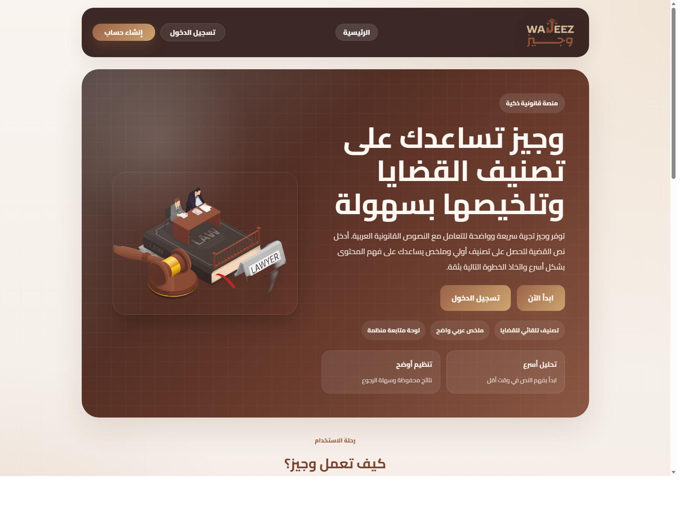
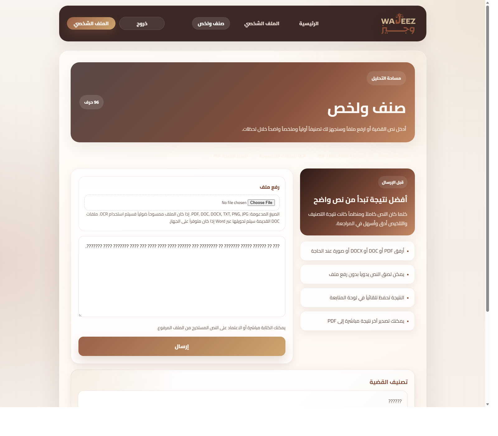

# وجيز - WAJEEZ

وجيز هو تطبيق ويب عربي لتصنيف القضايا القانونية وتلخيصها باستخدام الذكاء الاصطناعي، مع دعم رفع الملفات، OCR للملفات الممسوحة ضوئياً، ولوحة متابعة لعرض النتائج السابقة.

## المميزات

- تصنيف القضايا القانونية العربية
- تلخيص النصوص القانونية تلقائياً
- رفع ملفات `PDF` و `DOC` و `DOCX` و `TXT` والصور
- دعم `OCR` للملفات الممسوحة ضوئياً
- تصدير النتيجة إلى `PDF`
- لوحة متابعة تعرض الإحصائيات والملخصات الأخيرة

## لقطات من المشروع

### الصفحة الرئيسية



### صفحة التحليل والنتيجة



## التقنيات المستخدمة

- Python
- Flask
- Flask-Login
- Flask-SQLAlchemy
- scikit-learn
- Transformers
- PyTorch
- Tesseract OCR
- Chart.js

## التشغيل محلياً

```powershell
cd C:\Users\bushr\OneDrive\Desktop\Project\Project
.\.venv\Scripts\python.exe app.py
```

ثم افتح:

- [http://127.0.0.1:5000/](http://127.0.0.1:5000/)

## تثبيت المتطلبات

```powershell
pip install -r requirements.txt
```

## ملاحظات مهمة

- مجلد النموذج `AraBART_5epoch_5e5` كبير، لذلك تم تجهيزه ليرفع باستخدام `Git LFS`.
- مجلدات البيئة الافتراضية غير مضافة إلى Git.
- قاعدة البيانات المحلية داخل `instance/` غير مضافة إلى Git.

## بنية المشروع

```text
Project/
├── app.py
├── requirements.txt
├── README.md
├── static/
├── templates/
├── ocr-data/
├── AraBART_5epoch_5e5/
├── svm_model.pkl
└── tfidf_vectorizer.pkl
```
